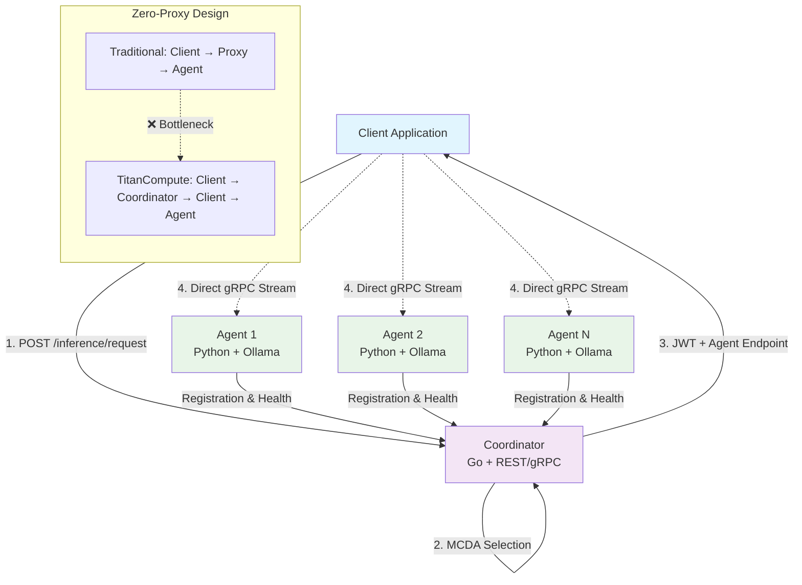

# TitanCompute

**Production-ready distributed LLM inference system with zero-proxy streaming architecture and intelligent MCDA scheduling.**

## 🎯 What is TitanCompute?

TitanCompute is a high-performance distributed system for Large Language Model (LLM) inference that eliminates traditional bottlenecks through **zero-proxy streaming**. Instead of routing inference data through a central proxy, TitanCompute's coordinator intelligently selects optimal compute nodes and provides clients with direct streaming connections.

## ✨ Key Features

- **🧠 Memory-Aware MCDA Scheduling**: Multi-criteria agent selection (40% VRAM + 30% Jobs + 20% RTT + 10% Performance)
- **🔄 Zero-Proxy Streaming**: Direct client-to-agent connections for maximum throughput
- **🔒 JWT Authentication**: RSA-256 signed tokens for secure agent access
- **⚖️ GGUF Quantization**: Intelligent model quantization based on available system memory
- **🛡️ Circuit Breaker Fault Tolerance**: Automatic failure detection and recovery
- **🐳 Production Ready**: Docker deployment with GPU support and health monitoring

## 🏗️ Architecture



## 🎯 Use Cases

### **High-Throughput Inference Workloads**
- Multiple concurrent LLM requests requiring optimal resource utilization
- Real-time applications needing low latency and high availability
- Production systems requiring automatic failover and load balancing

### **Multi-GPU Deployments**
- Distributed inference across multiple compute nodes
- Intelligent quantization for memory-constrained environments
- GPU resource optimization with VRAM-aware scheduling

### **Development and Testing**
- Local development with multiple model variants
- A/B testing different quantization strategies
- Performance benchmarking and optimization

### **Edge Computing**
- Resource-constrained edge deployments
- Automatic quantization based on available hardware
- Efficient model distribution and caching

## 🚀 Quick Start

```bash
# Deploy the system
./scripts/deploy.sh

# Test with REST API
cd client && python rest_client.py

# View system status
./scripts/deploy.sh status
```

For detailed setup instructions, see [QUICKSTART.md](QUICKSTART.md).

## 📁 Project Structure

```
TitanCompute/
├── coordinator/          # Go-based coordinator service
├── agent/               # Python-based agent service  
├── proto/               # gRPC protocol definitions
├── client/              # Client examples and testing tools
├── scripts/             # Deployment and validation scripts
├── docker-compose.yml   # Container orchestration
├── QUICKSTART.md       # Detailed setup guide
└── README.md           # This file
```

## 🔄 Request Flow

1. **Client** → `POST /api/v1/inference/request` → **Coordinator**
2. **Coordinator** → MCDA scheduling → Select optimal agent → Generate JWT token
3. **Client** ← JWT token + agent endpoint ← **Coordinator**  
4. **Client** → Direct gRPC streaming with JWT → **Selected Agent**
5. **Agent** → JWT validation → Model inference → Stream results → **Client**

## 📊 System Endpoints

| Service | gRPC | Description | M2 Features |
|---------|------|-------------|-------------|
| Coordinator | :50051 | MCDA routing + JWT auth | Circuit breaker, memory-aware scheduling |
| Agent 1 | :50052 | Direct streaming | GGUF quantization, JWT validation |
| Agent 2 | :50053 | Direct streaming | GGUF quantization, JWT validation |

## 🧪 Testing

All testing utilities are located in the [`client/`](client/) directory:

```bash
# REST API testing (recommended)
cd client && python rest_client.py

# Shell/curl testing  
cd client && ./test_curl.sh
```

For detailed testing options, see [`client/README.md`](client/README.md).

## ⚙️ Configuration

### Environment Variables

**Coordinator (M2 Enhanced):**
- `COORDINATOR_PORT=50051`: gRPC port
- `HEARTBEAT_TIMEOUT=30s`: Agent health timeout
- `TOKEN_TTL=300s`: JWT token lifetime (5 minutes)
- `CLEANUP_INTERVAL=60s`: Registry cleanup interval

**Agent (M2 Enhanced):**
- `AGENT_ID=agent-1`: Unique identifier
- `COORDINATOR_ENDPOINT=coordinator:50051`: Coordinator address
- `PUBLIC_HOST=localhost`: Public hostname for clients
- `MAX_CONCURRENT_JOBS=4`: Job capacity
- `SUPPORTED_MODELS=llama3.1:8b-instruct-q4_k_m`: Default models
- `OLLAMA_HOST=http://localhost:11434`: Ollama service endpoint

### GGUF Quantization Configuration
The system automatically selects quantization based on available memory:

| Memory Tier | Quantizations | Description |
|-------------|---------------|-------------|
| Premium (8GB+) | Q8_0, Q6_K_L, Q6_K | Near-original quality |
| High (6-8GB) | Q5_K_M, Q4_K_M, Q4_K_S | Balanced quality/size |
| Good (4-6GB) | IQ4_XS, Q3_K_L, IQ3_M | Efficient compression |
| Emergency (<4GB) | Q2_K, IQ2_M | Minimal memory usage |

## 🔧 Operations

### Service Management
```bash
# Start all services
./scripts/deploy.sh

# Stop services
./scripts/deploy.sh stop

# View system status
./scripts/deploy.sh status
```

### Model Management
```bash
# Access agent container
docker exec -it titan-agent-1 bash

# List available models
ollama list

# Pull models (system auto-selects quantization)
ollama pull llama3.1:8b-instruct-q4_k_m
```

### System Monitoring
```bash
# Monitor system resources
docker stats titan-coordinator titan-agent-1 titan-agent-2

# Check logs
docker-compose logs coordinator
docker-compose logs agent-1
```

### Quick API Testing
```bash
# REST API (direct inference)
curl -X POST http://localhost:8080/api/v1/inference/request \
  -H "Content-Type: application/json" \
  -d '{"client_id": "test", "model": "llama3.1:8b-instruct-q4_k_m", "prompt": "Hello!"}'

# Health check
curl http://localhost:8080/health
```

### Troubleshooting
```bash
# Check service health
curl http://localhost:8080/health

# View detailed logs
docker-compose logs -f
```

## 📊 Performance Targets

| Metric | Target | Implementation |
|--------|--------|----------------|
| Time-to-First-Token | < 500ms (p95) | MCDA scheduling + model preloading |
| Inter-Token Latency | < 50ms | Direct streaming + GGUF optimization |
| Concurrent Streams/Agent | 4-8 streams | GPU memory management |
| System Availability | > 99.5% | Circuit breaker fault tolerance |
| Memory Efficiency | 30-60% reduction | GGUF quantization |

## 🎯 Production Features

### Memory-Aware MCDA Scheduling
- Multi-Criteria Algorithm: 40% VRAM + 30% Jobs + 20% RTT + 10% Performance
- Intelligent model placement with automatic VRAM estimation
- Real-time adaptation based on current system state

### Circuit Breaker Fault Tolerance
- Three-state pattern: Closed → Open → Half-Open
- Automatic recovery with configurable thresholds
- Graceful degradation for struggling agents

### GGUF Quantization Support
- Full Bartowski range: Q8_0 to IQ2_M (13 formats)
- Memory-aware selection based on available RAM
- Intelligent fallback for memory-constrained environments

### JWT Authentication & Security
- RSA-256 signed tokens with 5-minute TTL
- Secure agent validation via public key distribution
- Industry-standard cryptographic security

## � Documentation

For detailed component documentation, see:
- [`agent/README.md`](agent/README.md) - Python agent implementation
- [`coordinator/README.md`](coordinator/README.md) - Go coordinator service  
- [`proto/README.md`](proto/README.md) - Protocol buffer definitions
- [`client/README.md`](client/README.md) - Client examples and testing
- [`scripts/README.md`](scripts/README.md) - Deployment and validation scripts

---

**TitanCompute** - Production-ready distributed LLM inference with zero-proxy streaming architecture.
